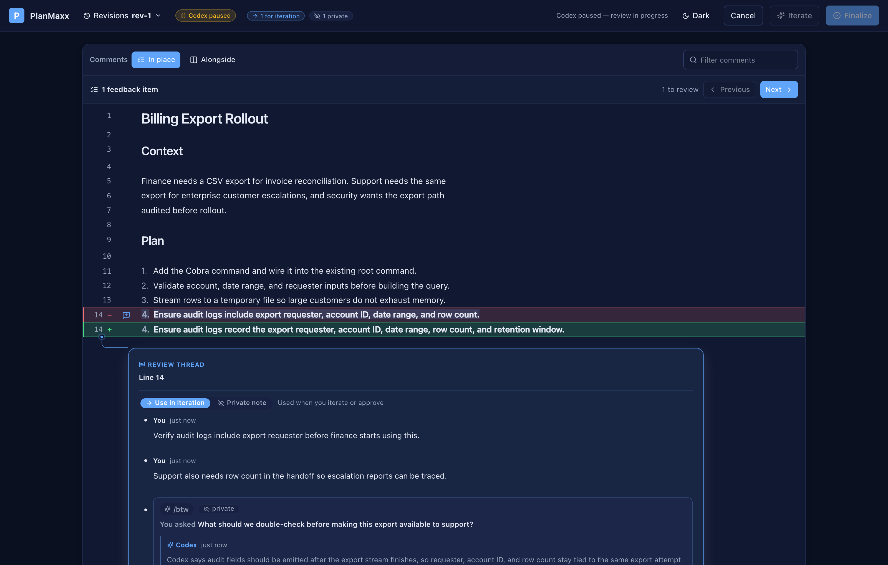
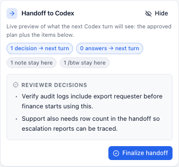
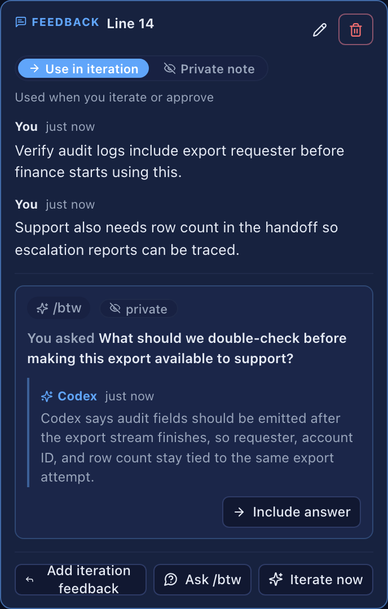

<p align="center">
  
</p>

<h1 align="center">PlanMaxx</h1>

<p align="center">
  <strong>Review, discuss, and refine coding-agent plans before they become code.</strong>
</p>

<p align="center">
  A beautiful, local-first review workspace delivered as one self-contained executable.
</p>

<p align="center">
  <a href="https://github.com/AlhasanIQ/planmaxx/actions/workflows/ci.yml"></a>
  <a href="https://github.com/AlhasanIQ/planmaxx/releases"></a>
  <a href="LICENSE"></a>
</p>

<p align="center">
  <a href="#quick-start">Quick start</a> ·
  <a href="#screenshots">Screenshots</a> ·
  <a href="#what-it-does">Features</a> ·
  <a href="#development">Contributing</a>
</p>

---

PlanMaxx gives coding-agent plans a proper review loop: a readable visualizer,
anchored comments, private side conversations that preserve context, revision
history, and multi-turn iteration before handoff. It works with Claude Code and
other plan-file workflows and is currently optimized for Codex.

## Install

PlanMaxx is distributed as a self-contained binary. Go, Bun, and Node are not
required for users.

```bash
bash -c 'set -o pipefail; curl -fsSL https://raw.githubusercontent.com/AlhasanIQ/planmaxx/main/install.sh | bash'
```

By default the installer puts `planmaxx` in `$HOME/.local/bin` on Linux and
macOS. On Windows bash environments, it installs `planmaxx.exe` in the same
location. Use `--install-dir` or `PLANMAXX_INSTALL_DIR` to choose another
directory.

```bash
planmaxx version
```

### Automatic Codex Skill

PlanMaxx can also install an optional user-level Codex skill. In that mode,
Codex can discover PlanMaxx from the skill frontmatter and use it automatically
when an agent-written plan is ready for user review.

Install the binary only for manual use:

```bash
bash -c 'set -o pipefail; curl -fsSL https://raw.githubusercontent.com/AlhasanIQ/planmaxx/main/install.sh | bash'
```

Install the binary and opt into automatic Codex plan review:

```bash
bash -c 'set -o pipefail; curl -fsSL https://raw.githubusercontent.com/AlhasanIQ/planmaxx/main/install.sh | bash -s -- --install-codex-skill'
```

You can also add or remove the skill later:

```bash
planmaxx skill install --target codex
planmaxx skill remove --target codex
```

The skill is installed under `$HOME/.agents/skills/planmaxx` by default. Use
`--repo /path/to/repo` with either command to install it under that
repository's `.agents/skills/planmaxx` directory.

## Quick Start

When working with an agent, ask it to use PlanMaxx for plan review, or just
tell the agent to "use planmaxx". The agent should write its plan to a Markdown
or HTML file, run the review, wait for your decision, and continue only from the
PlanMaxx handoff.

If you already have a Markdown or HTML plan file, run:

```bash
planmaxx review path/to/plan.md
# or
planmaxx review path/to/plan.html
```

PlanMaxx starts a local server on `127.0.0.1`, opens your browser, and blocks
until you approve, reject, or cancel the review.

On approval or rejection, the command prints the reviewed plan and review digest
to stdout. Return that output to your agent if it is not already running the
command itself.

## Screenshots



The review workspace keeps the plan, anchored comments, revision history, and
handoff preview visible in one local browser session.

HTML plans open in a scriptless, network-blocked Preview. Switch to Source for
exact line and text comments, side questions, iteration, and revision diffs;
the final handoff always contains the original active HTML source, never a DOM
serialization of the preview.

<p>
  
  
</p>

The submission review shows what will be sent back to Codex. Feedback defaults
to **Use in iteration**, private notes stay local, and `/btw` answers remain
private unless you explicitly include them.

## What It Does

- Renders long plans in a readable local review UI.
- Adds threaded comments anchored to lines or text ranges.
- Keeps private notes out of the final handoff.
- Lets you include useful side-question answers in the next iteration or approval.
- Supports focused section rewrites and proposal diffs before final approval.
- Provides Previous/Next navigation across feedback and every otherwise
  uncovered change in a proposal or revision comparison.
- Separates active feedback, items that need re-anchoring, and addressed
  revision history without conflating them into one status.
- Turns final-review feedback into a whole-plan proposal; the checked-out plan
  stays unchanged until **Apply as new revision** is clicked.
- Autosaves review state next to the plan file as
  `<plan-file>.planmaxx-review.json`, with a cache-directory fallback if that
  location is not writable.

## Codex Integration

Basic review works with Markdown (`.md`, `.markdown`) and HTML (`.html`, `.htm`)
plan files. Unknown extensions retain the historical Markdown behavior.

Side questions and section rewrites require a Codex app-server context. When
`CODEX_THREAD_ID` is available, PlanMaxx starts:

```bash
codex app-server --listen stdio://
```

If that context is unavailable, PlanMaxx disables agent-assisted side actions
instead of guessing from copied context.

## Privacy

PlanMaxx is local-first. The review server binds to `127.0.0.1` by default and
review state is stored in a local autosave file. Side questions and section
rewrites are sent through Codex only when the current Codex thread context is
available.

## Development

Requirements for contributors:

- Go 1.22+
- Bun

```bash
cd web && bun install
./scripts/build-web.sh
go test ./...
go vet ./...
cd web && bun test && bunx tsc --noEmit
./scripts/e2e-smoke.sh
```

The web UI is built into `internal/review/static/` and embedded into the Go
binary. That directory is generated and ignored. On a fresh clone, run
`./scripts/build-web.sh` before `go build` or `go test ./...`.

For UI screenshots, run `node scripts/render-review.mjs`.

## Release

Releases are built by GitHub Actions from version tags. Each release includes
Linux, macOS, and Windows archives, a version-matched `SKILL.md`,
`checksums.txt`, and tagged source archives.

See [docs/release.md](docs/release.md).

## License

PlanMaxx is licensed under GPLv3. See [LICENSE](LICENSE).
