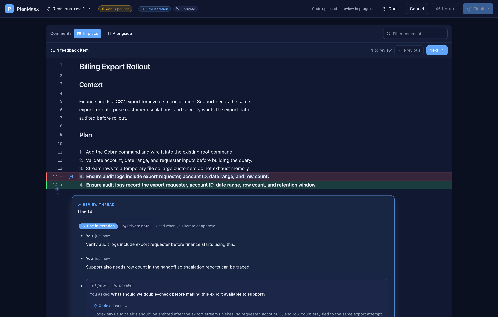
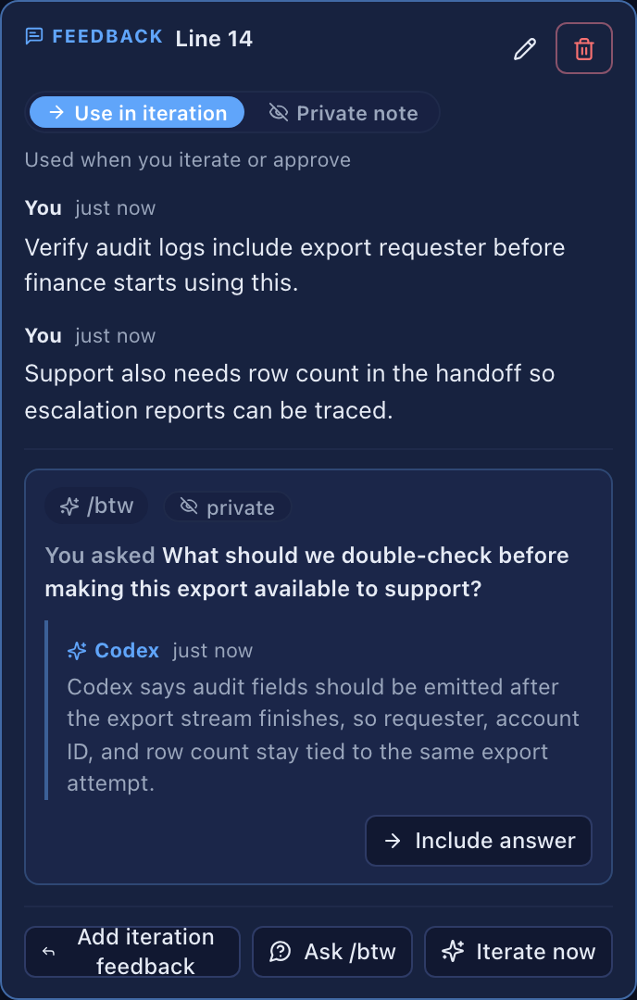
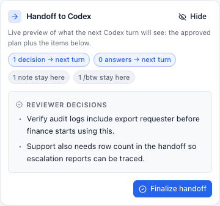

<p align="center">
  
</p>

<h1 align="center">PlanMaxx</h1>

<p align="center"><strong>Review and refine coding-agent plans before implementation.</strong></p>

PlanMaxx is a local review UI for Markdown and HTML plans. It supports anchored
comments, private notes and side questions, revision history, iteration, and an
approved handoff back to the agent.

## Install

```bash
bash -c 'set -o pipefail; curl -fsSL https://github.com/AlhasanIQ/planmaxx/releases/latest/download/install.sh | bash'
planmaxx version
```

The installer puts the PlanMaxx binary in `$HOME/.local/bin` by default.
Use `--install-dir` or `PLANMAXX_INSTALL_DIR` to change the location.
Review storage uses native Git, so `git` must also be installed and available
on `PATH`.

Update an installed release in place with:

```bash
planmaxx update
```

Claude Code and Grok Build skills are copied rather than linked. After an
update, rerun the matching `planmaxx skill install --target <harness>` command
with the same user or `--repo` scope.

Released builds check GitHub for updates at review startup at most once every
24 hours. If one exists, the final handoff includes a short update notice and
the update command. Check failures never block review. Set
`PLANMAXX_NO_UPDATE_CHECK=1` to disable automatic checks.

## Supported harnesses

Core review means Markdown and HTML preview, anchored comments, private notes,
revision history, proposal review, approval, plan saving, and the final
handoff. It works without an agent. Assisted features use a disposable fork of
the attached active session.

| Harness | Setup and attachment | Core review | `/btw` | Iterate and refine | Assisted file context | Isolation |
| --- | --- | :---: | :---: | :---: | --- | --- |
| Manual CLI | `planmaxx review <plan>`; `auto` selects `none` when no session is present | Yes | No | No | Not applicable | Local UI and storage only |
| Codex | Shared Agent Skill; auto-attaches with `CODEX_THREAD_ID` | Yes | Yes | Yes | Original workspace at the caller's CWD, read-only | Ephemeral active-session fork; approval `never`; read-only sandbox; network off |
| Claude Code | Native `/planmaxx` skill passes the exact `${CLAUDE_SESSION_ID}` | Yes | Yes | Yes | Session and PlanMaxx request context; child tools are disabled | Safe-mode active-session fork; `dontAsk`; no persistence, hooks, plugins, skills, MCP, or custom instructions |
| Grok Build | Native `/planmaxx` skill passes the exact `${SESSION_ID}` | Yes | Yes | Yes | Temporary workspace copy at the same relative CWD; `read_file`, `grep`, and `list_dir` only | Restricted active-session fork; no shell, edits, web, MCP, memory, or subagents; temporary session and files are deleted |

Grok assisted features require macOS or Linux; its core review works on
Windows. Assisted Claude Code requires version 2.1.214 or newer, and Grok Build
requires version 0.2.114 or newer.

### Install an agent skill

Install after the binary:

```bash
# Codex
planmaxx skill install

# Claude Code
planmaxx skill install --target claude

# Grok Build
planmaxx skill install --target grok
```

Alternatively, add `--install-codex-skill`, `--install-claude-skill`, or
`--install-grok-skill` to the release installer command.

These install user-wide by default:

| Harness | User skill path | Repository skill path |
| --- | --- | --- |
| Codex | `~/.agents/skills/planmaxx/` | `.agents/skills/planmaxx/` |
| Claude Code | `~/.claude/skills/planmaxx/SKILL.md`, or `$CLAUDE_CONFIG_DIR/skills/planmaxx/SKILL.md` | `.claude/skills/planmaxx/SKILL.md` |
| Grok Build | `~/.grok/skills/planmaxx/SKILL.md`, or `$GROK_HOME/skills/planmaxx/SKILL.md` | `.grok/skills/planmaxx/SKILL.md` |

Add `--repo /path/to/repo` for a repository install, and use the matching
`planmaxx skill remove` command to remove it. Claude Code and Grok Build use
plain native skills: no hook, session-start setup, plugin, or persistent
environment change is installed. Re-running an install safely refreshes a
PlanMaxx-managed copy and refuses to overwrite a customized native skill.

Detection is automatic. `auto` prefers the exact Claude or Grok session ID
provided only when its skill is invoked, then Claude's ambient subprocess
marker, then Codex's active thread marker. It deliberately ignores ambient
`GROK_SESSION_ID` and never selects a harness merely because its executable is
installed. Use `--agent codex`, `--agent claude`, `--agent grok`, or
`--agent none` to override detection. If attachment fails, assisted controls
are disabled while core review remains available.

See the detailed [agent integration contract](docs/agent-integrations.md),
[Claude Code skill documentation](https://code.claude.com/docs/en/slash-commands),
and [Grok Build skill documentation](https://docs.x.ai/build/features/skills-plugins-marketplaces).

## Quick Start

Ask your agent to use PlanMaxx, or tell the agent to "use planmaxx". For an
existing plan, run:

```bash
planmaxx review path/to/plan.md
planmaxx review path/to/plan.html
```

PlanMaxx opens a local browser and waits for one outcome:

- **Finalize** approves the current plan and emits its handoff.
- **Iterate** creates a proposal to review before it becomes a revision.
- **Cancel** exits without a handoff.
- **Orphan cleanup** stops the process after no review tab has been connected
  for one hour.

The approved handoff is always printed to stdout. On finalization, PlanMaxx
writes the finalized plan back to its source file by default. Pass
`--save-to-file <path>` to write only the finalized plan content to a different
file instead; the handoff prompt is never written there. No plan file is
written on cancel or orphan cleanup. Orphaned progress remains in the active
review bundle and is restored on the next run. Use
`--orphan-timeout <duration>` to change the one-hour delay, or
`--orphan-timeout 0` to disable automatic cleanup.

## Screenshots

In-place review keeps the proposed diff and its dedicated review thread in one
reading flow.



Alongside review anchors a separate feedback card to its source line, while the
handoff preview makes the final agent context inspectable before approval.

<p>
  
  
</p>

## Review behavior

- Comments attach to exact source lines or text ranges.
- Active feedback can drive iteration or remain private.
- Detached feedback can be reanchored or recorded as addressed on the revision
  that applied it.
- Addressed feedback remains read-only revision history.
- The floating review queue moves through every feedback item and every changed
  region independently, with `Alt+↑` / `Alt+↓` keyboard navigation.
- The document outline follows Markdown headings and HTML headings or labelled
  sections, and navigates the rendered HTML Preview without leaving it.
- `/btw` answers remain private unless explicitly included.
- Applying a proposal creates a revision; creating or refining one does not.
- Starting with no browser, or closing the last connected review tab, starts
  the orphan timeout. Opening or restoring a tab before it expires cancels
  cleanup.
- The complete review workspace is one private `.planmaxx` Git bundle in the
  platform's user-state directory. It includes revision commits, a pending
  proposal ref, feedback notes, finalization tags, and versioned domain state;
  nothing is written beside the plan by default. Pass `--local-bundle` to keep
  `<plan-file>.planmaxx` beside the plan instead.

### HTML plans

- Preview renders common planning content—including headings, lists, tables,
  code, SVG diagrams, and collapsible details—in an isolated iframe.
- Select rendered text for a range comment, or hover and click an element for a
  whole-element comment. Target borders and existing highlights make anchors
  visible without interfering with text selection.
- In-place and alongside threads support comments, private notes, `/btw`, and
  section iteration through the same source-backed anchors. In-place cards sit
  directly below their rendered element; alongside cards track the anchor while
  Preview scrolls. Clicking either side pulses and scrolls to its counterpart.
- The outline navigates Preview without switching to Source. Preview and Source
  scroll positions stay synchronized and are preserved when switching views.
- Source remains authoritative, is structurally indented, and uses Shiki
  highlighting. Proposal and revision diffs open in Source.
- Authored scripts, event handlers, controls, and remote resources are removed;
  only PlanMaxx's nonce-restricted annotation bridge can run.

## Storage tools

Inspect the bundle, active write lock, matching review processes, and any
legacy sidecars or revision stores:

```bash
planmaxx doctor path/to/plan.md
```

Create a verified, portable copy of the complete review workspace:

```bash
planmaxx snapshot path/to/plan.md --out review-backup.planmaxx
```

The `export` command is an alias for `snapshot`. Existing destinations require
`--force`. Legacy files are imported on the next review but are never deleted
automatically. Both storage commands accept `--bundle <path>` when a review was
created with a non-default bundle location.

## Privacy

The server binds to `127.0.0.1` by default and stores review state locally.
Agent-assisted actions use the selected active-session fork and the restrictions
shown in the harness table; PlanMaxx never falls back to a copied-context fresh
session. Provider authentication and source transcripts remain owned by the
locally installed harness. Released builds also make a cached request to the
public GitHub Releases API at review startup; set
`PLANMAXX_NO_UPDATE_CHECK=1` to disable it.

## Development

Requires Go 1.22+ and Bun.

```bash
cd web && bun install
cd ..
./scripts/build-web.sh
go test ./...
go vet ./...
cd web && bun test && bunx tsc --noEmit
```

Build the UI before Go builds or tests. Generated files under
`internal/review/static/` are embedded in the binary and must not be committed.
See [CONTRIBUTING.md](CONTRIBUTING.md) and [docs/release.md](docs/release.md).

Additional end-to-end and visual checks are available through
`scripts/e2e-smoke.sh`, `scripts/e2e-browser.sh`, and
`scripts/render-review.mjs`.

## License

GPLv3. See [LICENSE](LICENSE).
